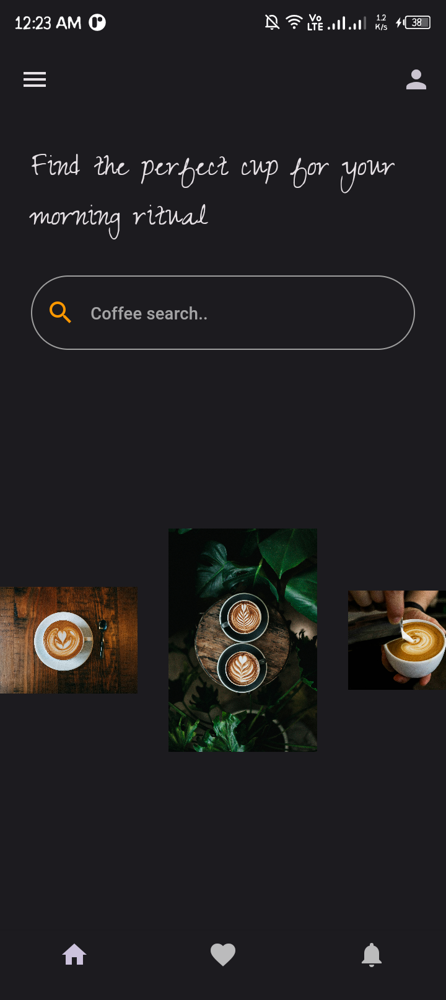
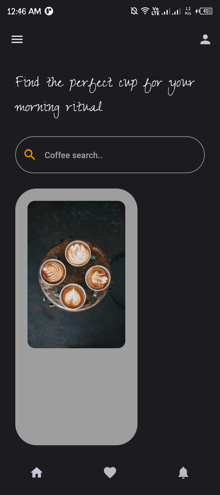

<<<<<<< HEAD
# coffee_ui

A new Flutter project.

## Getting Started

This project is a starting point for a Flutter application.

A few resources to get you started if this is your first Flutter project:

- [Lab: Write your first Flutter app](https://docs.flutter.dev/get-started/codelab)
- [Cookbook: Useful Flutter samples](https://docs.flutter.dev/cookbook)

For help getting started with Flutter development, view the
[online documentation](https://docs.flutter.dev/), which offers tutorials,
samples, guidance on mobile development, and a full API reference.
=======
# Coffee UI App

A simple and elegant Flutter app that provides a delightful user interface for exploring and finding your perfect coffee match.

## Screenshots


*Caption for the first screenshot.*


*Caption for the second screenshot.*

## Features

- Feature 1
- Feature 2
- ...

## Getting Started

Follow these instructions to get a copy of the project running on your local machine.

### Prerequisites

- [Flutter SDK](https://flutter.dev/docs/get-started/install)

### Installation

1. Clone the repository:

   ```bash
   git clone https://github.com/ManU4kym/coffee_ui.git

>>>>>>> 7cdd02314dc539d5516b0a22a3b5516999e8feed
